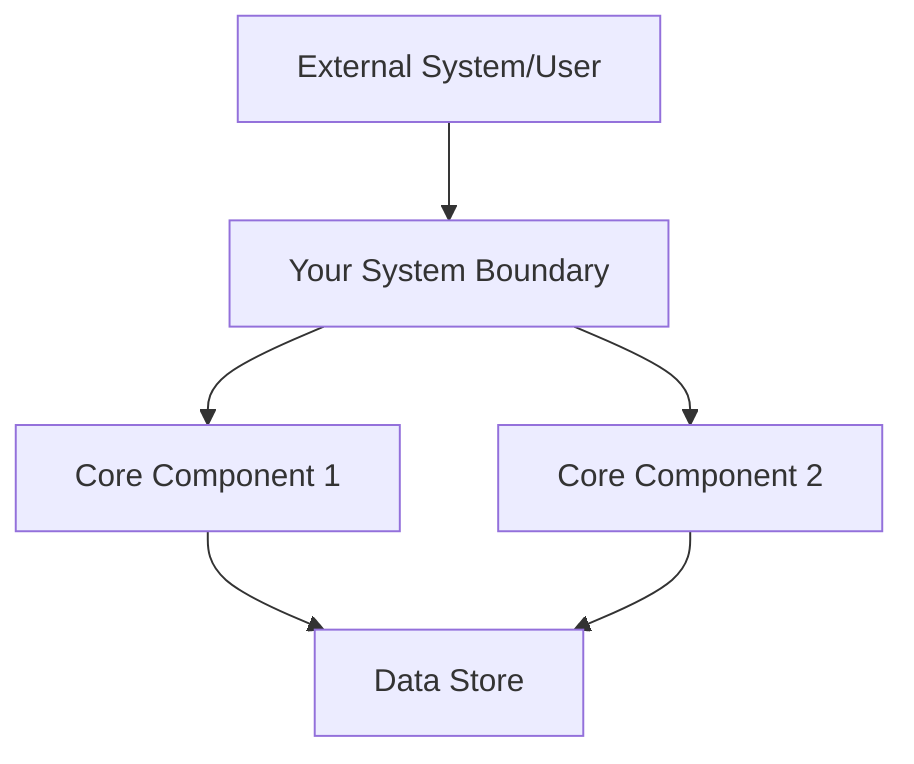
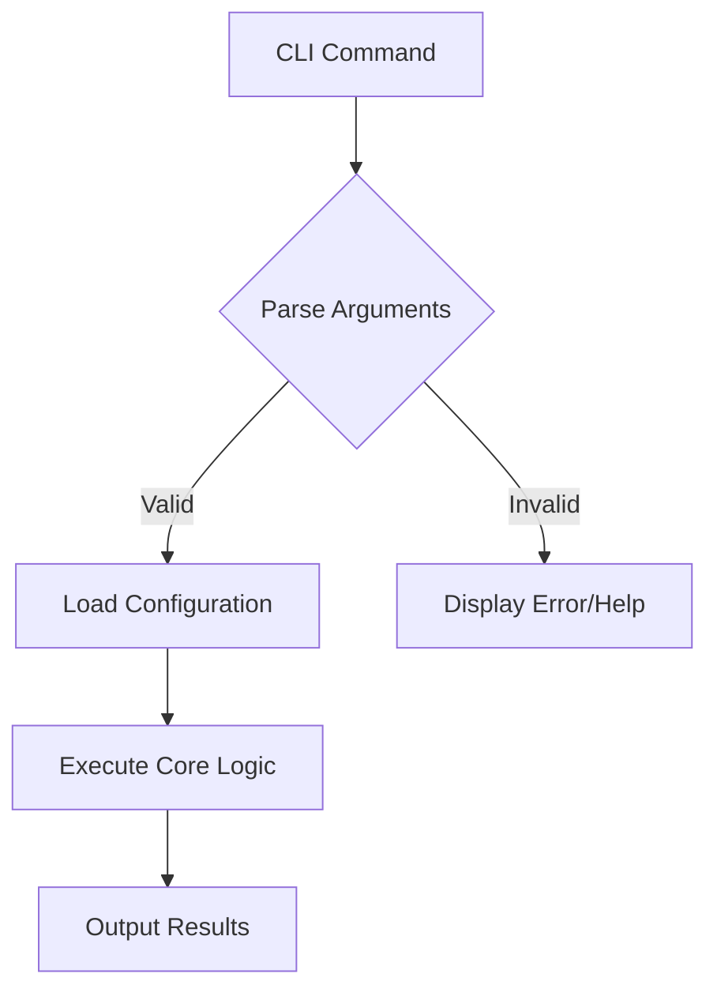
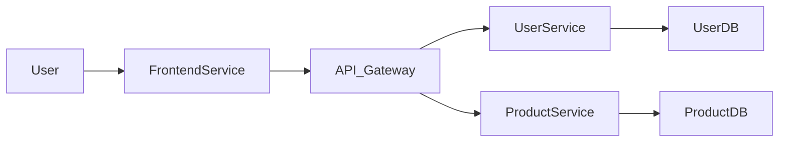
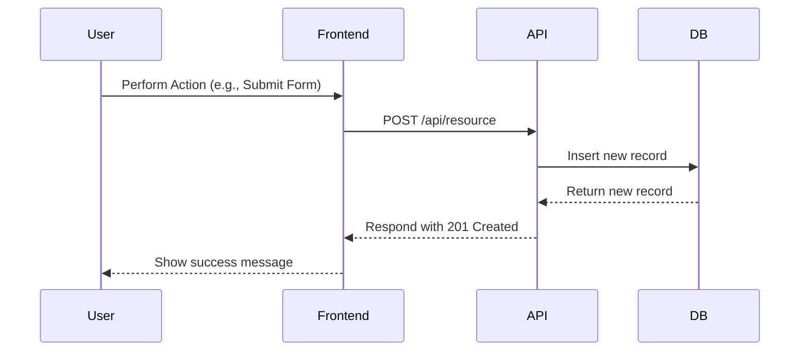
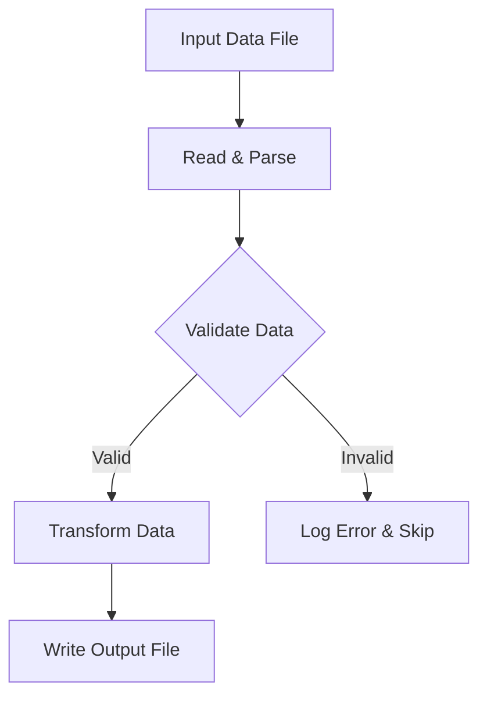
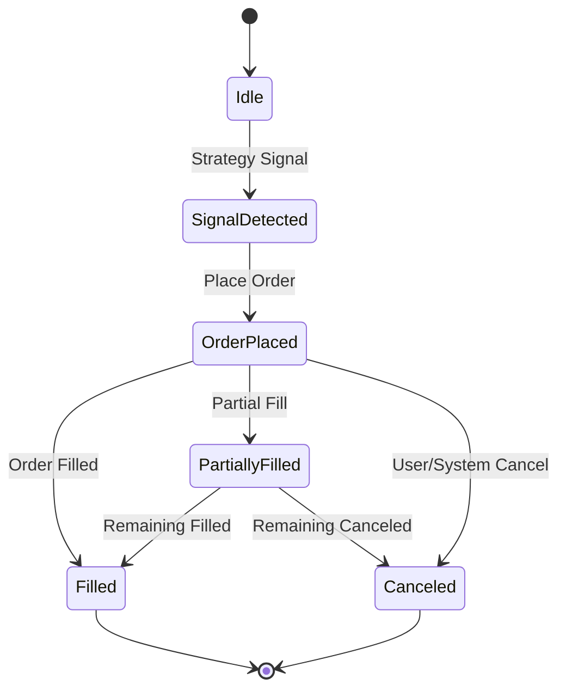
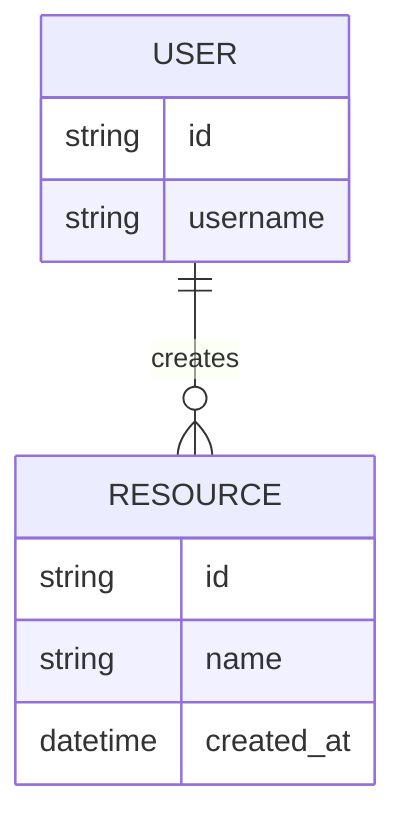

# Design: {{args}}

## 1. Overview
[High-level description of the feature/system and its place in the overall architecture. This section should provide a quick understanding of what is being designed.]

## 2. Project Type & Scope
[Clearly define the type of project this design pertains to and its overall scope, mirroring the requirements document for consistency.]

*   **Project Type**: [e.g., Web Application (Frontend/Backend), CLI Tool, Library/SDK, Automated Trading System, Desktop Application, Mobile App, Data Processing Script]
*   **Primary Purpose**: [What is the main problem this project solves or the primary value it delivers?]
*   **Non-Goals**: [What is explicitly out of scope for this project/feature?]

## 3. Requirements Mapping
[Traceability matrix showing how design components map to specific requirements from `requirements.md`. Ensure mapping to the generalized requirements.]
- **Component [Component Name]:** Fulfills Requirement(s) 3.1, 3.2
- **Interface `/api/{{args}}`:** Fulfills Requirement(s) 3.1

## 4. Steering Document Alignment
- **Technical Standards (`tech.md`):** [How the design follows documented technical patterns and standards.]
- **Project Structure (`structure.md`):** [How the implementation will follow project organization conventions.]

## 5. Code Reuse Analysis
- **Existing Components to Leverage:**
  - `[Component/Utility Name]`: [How it will be used.]
- **Integration Points:**
  - `[Existing System/API]`: [How the new feature will integrate.]

## 6. Architecture Overview
[Describe the overall architecture and design patterns used. Include a Mermaid diagram for clarity. Choose a diagram type that best represents the system's structure (e.g., Component Diagram, Deployment Diagram, High-Level Flowchart).]


*Example for a simple CLI tool's internal flow:*

*Example for a microservices architecture:*


## 7. Data Flow & Processing
[Describe how data flows through the system for the main scenarios. Use a sequence diagram, flowchart, or state diagram as appropriate.]

*Example for a Web API request:*

*Example for a data processing script:*

*Example for an automated trading system's order lifecycle:*


## 8. Interaction Model & Interfaces
[Describe the specific interfaces and interaction points of the system. This generalizes API endpoints to include CLI commands, library functions, message queues, etc.]

*   **CLI Commands**:
    *   `command-name <arg1> --option <value>`: [Purpose]
    *   Input/Output formats: [e.g., JSON, CSV, plain text]
*   **HTTP/REST APIs**:
    *   | Method | Route                  | Purpose                | Auth?    | Request Body (Example) | Success Codes | Error Codes       |
    *   |--------|------------------------|------------------------|----------|------------------------|---------------|-------------------|
    *   | POST   | /api/resource          | Create a new resource  | Required | `{ "name": "example" }`  | 201           | 400, 401, 500     |
*   **Library/SDK Functions**:
    *   `functionName(param1: Type, param2: Type): ReturnType`: [Purpose]
    *   Error handling: [e.g., throws specific exceptions]
*   **Message Queues/Event Streams**:
    *   Topic/Queue Name: `order_events`
    *   Message Schema: [JSON schema for `OrderCreated`, `OrderFilled` events]
*   **User Interface (UI) Components**:
    *   Key screens/views: [e.g., Dashboard, Settings Page]
    *   Interaction patterns: [e.g., form submission, drag-and-drop]

## 9. Data Structures & Persistence
[Describe the data models, schemas, and how data is stored and managed. This generalizes entity relationships to include file formats, in-memory structures, etc.]

### Entity Relationship Diagram (for relational databases)


### Data Contracts / Schemas (Language-Specific or Format-Specific)
*Example for TypeScript interface:*
```typescript
// Invariant: name must not be empty.
interface Resource {
  id: string;
  name: string;
  createdAt: Date;
}
```
*Example for JSON Schema (for API requests/responses or file formats):*
```json
{
  "$schema": "http://json-schema.org/draft-07/schema#",
  "title": "Configuration",
  "type": "object",
  "properties": {
    "apiKey": {
      "type": "string",
      "description": "API key for external service"
    },
    "maxRetries": {
      "type": "integer",
      "minimum": 0,
      "default": 3
    }
  },
  "required": ["apiKey"]
}
```
*Example for File Format (for CLI/script):*
```
# CSV Format for Input Data
# Header: id,name,value
# Example: 1,item_a,100
```

## 10. Operations & Monitoring Design
[Design considerations for deploying, running, observing, and maintaining the system in production.]

*   **Deployment Strategy**: [e.g., Docker containers, Serverless functions, standalone executable]
*   **Logging**:
    *   Logging levels: [e.g., DEBUG, INFO, WARN, ERROR]
    *   Log format: [e.g., JSON, plain text]
    *   Log destinations: [e.g., stdout, file, centralized logging system like ELK stack]
*   **Metrics & Alerting**:
    *   Key metrics to expose: [e.g., request latency, error rates, CPU/memory usage, custom business metrics like "orders placed per minute"]
    *   Monitoring tools: [e.g., Prometheus, Grafana, CloudWatch]
    *   Alerting rules and notification channels: [e.g., PagerDuty, Slack]
*   **Configuration Management**: [e.g., Environment variables, dedicated config files, centralized config service]
*   **Health Checks**: [e.g., HTTP endpoints, CLI commands for status checks]

## 11. Performance & Scalability Design
[Design choices made to meet performance and scalability requirements.]

*   **Optimization Techniques**: [e.g., Caching strategy (Redis, CDN), Database indexing, Asynchronous processing, Concurrency model]
*   **Load Balancing**: [e.g., Nginx, AWS ELB]
*   **Scaling Strategy**: [e.g., Horizontal scaling of stateless services, Read replicas for databases]
*   **Specific Algorithms/Data Structures**: [e.g., Using a hash map for O(1) lookups, optimized sorting algorithms]
*   **Latency Reduction**: [e.g., Colocation with exchange APIs for trading systems, minimizing network hops]

## 12. Security & Reliability Design
[Design choices made to ensure the system is secure and resilient to failures.]

*   **Authentication & Authorization**: [e.g., JWT-based authentication, Role-Based Access Control (RBAC)]
*   **Input Validation**: [e.g., Using Zod/Joi for schema validation on all incoming data]
*   **Error Handling & Fault Tolerance**: [e.g., Circuit breakers, Retry mechanisms with exponential backoff, Idempotent operations]
*   **Data Protection**: [e.g., Encryption at rest and in transit, Data masking for sensitive information]
*   **Secret Management**: [e.g., Using AWS Secrets Manager, HashiCorp Vault for API keys and credentials]
*   **Disaster Recovery**: [e.g., Backup and restore procedures, Multi-region deployment]
*   **Automated Trading System Specifics**: [e.g., Cold storage for funds, Whitelisting withdrawal addresses, Kill switch mechanisms]

## 13. Integration Points & Dependencies Design
[Detailed design of how the system interacts with external services, APIs, or hardware, and management of its external dependencies.]

*   **External API Integration**: [e.g., Specific API versions, Rate limit handling, Error mapping, Authentication mechanisms for external APIs]
*   **Third-Party Libraries**: [e.g., Justification for choosing specific libraries, Dependency management strategy (e.g., npm, pip, Go modules)]
*   **Hardware Interfaces**: [e.g., Communication protocols, Driver requirements]
*   **Data Exchange Formats**: [e.g., Protocol Buffers, Avro, custom binary formats]

## 14. Testing & Validation Design
[Detailed design of the testing strategy to ensure the system meets its requirements and quality attributes.]

*   **Unit Testing**: [e.g., Frameworks used, Mocking strategy, Coverage goals for specific modules]
*   **Integration Testing**: [e.g., Scope of integration tests (e.g., API to DB, service to service), Test data management]
*   **End-to-End Testing**: [e.g., Tools used (e.g., Playwright, Cypress), Critical user flows to be covered]
*   **Performance Testing**: [e.g., Load testing tools (e.g., JMeter, k6), Scenarios to test]
*   **Security Testing**: [e.g., Penetration testing, Vulnerability scanning]
*   **Automated Trading System Specifics**:
    *   **Backtesting**: [e.g., Backtesting engine design, Data sources for historical data, Metrics for strategy evaluation]
    *   **Paper Trading/Simulation**: [e.g., Design of the simulated exchange environment]
    *   **Replay Testing**: [e.g., Ability to replay production market data/events for debugging]