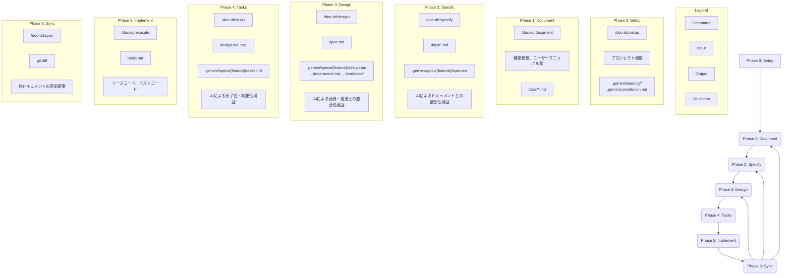

# 計画書: AI-DLCベースのドキュメント駆動開発ワークフロー for Gemini CLI

## 1. 概要

本ワークフローは、`claude-code-spec-workflow`の構造的な堅牢性と、`spec-kit`の厳格な原則主義を、`AI-DLC`の双方向同期思想で統合した、新しいドキュメント駆動開発（Document-Driven Development, Doc-DD）の実現を目指すものです。

開発の起点をステークホルダー向けドキュメントとし、そこから仕様、設計、タスク、コードへと展開します。そして、コードの変更を検知して上位のドキュメント群にフィードバックする「同期」プロセスを設けることで、**「ドキュメントが常に最新であり、開発の中心であり続ける」**状態を実現します。

## 2. 参考にしたプロンプトとテンプレート

- **`claude-code-spec-workflow`より**:
    - **Steering Documents (`product.md`, `tech.md`, `structure.md`)**: プロジェクト全体の一貫性を保つ「指針書」の概念。
    - **AI検証エージェント (`spec-*-validator.md`)**: 各フェーズの生成物を自動検証し品質を担保するプロセス。
    - **明確なフェーズ分割**: 要求→設計→タスク→実装という段階的な開発フロー。

- **`spec-kit`より**:
    - **憲法 (`constitution.md`)**: TDD強制など、プロジェクトの譲れない原則を定義・チェックする仕組み。
    - **関心の分離 (`/specify`, `/plan`)**: 「WHAT/WHY」と「HOW」を明確に分離するコマンド体系。
    - **具体的な設計成果物**: `data-model.md`や`contracts/`など、詳細な設計ドキュメントの定義。

## 3. ワークフローの全体像とフェーズ

ワークフローは、0から6までの7つのフェーズで構成されます。コード実装後に`Phase 6: Sync` を実行することで、変更が上位のドキュメントに伝播し、継続的なライフサイクルが形成されます。

## 4. カスタムコマンド詳細

### `/doc-dd:setup` (Phase 0: Setup)
- **役割**: プロジェクトの初期設定。対話形式でプロジェクトの目的、技術スタック、構造、そして開発上の「憲法」を定義する。
- **プロセス**:
    1. プロジェクト内の既存ファイルを分析し、技術スタック（言語、フレームワーク）、ディレクトリ構造、依存関係を推論する。
    2. ユーザーとの対話を通じて、以下の `Steering Documents` を `.gemini/steering/` ディレクトリに生成する。
        - `product.md`: プロダクトの目的、ターゲットユーザー、主要機能。
        - `tech.md`: 主要な技術スタック、ライブラリ、アーキテクチャ方針、技術的制約。
        - `structure.md`: ディレクトリ構成、命名規則、インポート/エクスポートの規約。
    3. ユーザーに選択肢を提示し、プロジェクトで強制する譲れない原則を `.gemini/constitution.md` として定義させる。
        - `[TODO constitution.mdに含めるべき原則の具体的なリスト（例: TDDの強制、セマンティックバージョニング、構造化ロギング、特定デザインパターンの禁止）は、プロジェクト開始時にユーザーへ選択肢として提示する形式か、あるいは固定のベストプラクティスを適用するか？]`

### `/doc-dd:document <topic>` (Phase 1: Document)
- **役割**: 開発の起点となるステークホルダー（非開発者を含む）向けのドキュメントを作成・更新する。
- **プロセス**: ユーザーが与えたトピックと説明に基づき、`docs/` 配下にマークダウンドキュメント（例: `docs/user-manual.md`, `docs/api-overview.md`）を生成・更新する。

### `/doc-dd:specify <feature-name>` (Phase 2: Specify)
- **役割**: ステークホルダー向けドキュメントから、開発者向けの具体的な機能仕様書を生成する。
- **プロセス**:
    1. 関連する `docs/` 配下のドキュメント群をコンテキストとして読み込む。
    2. `.gemini/specs/{feature-name}/spec.md` を生成する。内容は以下を含む。
        - **ユーザーーストーリー**: 「As a [役割], I want [機能], so that [利益]」形式で記述。
        - **受け入れ基準**: 「Given [前提], When [操作], Then [結果]」形式で記述された、テスト可能な基準。
        - **機能要件**: 振る舞い、性能、セキュリティに関する具体的な要件リスト。
        - **非機能要件**: パフォーマンス、スケーラビリティ、可用性に関する要件。
        - **主要エンティティ**: この機能で扱われる主要なデータや概念のリスト。
    3. **AI検証**: 生成された `spec.md` が、入力とされた `docs/` の内容と矛盾していないか、受け入れ基準に曖昧さがないかを検証し、レポートする。

### `/doc-dd:design <feature-name>` (Phase 3: Design)
- **役割**: 機能仕様書を、具体的な技術設計書群に落とし込む。
- **プロセス**:
    1. `.gemini/specs/{feature-name}/spec.md` と、`.gemini/steering/` 配下の `Steering Documents` をすべて読み込む。
    2. `.gemini/specs/{feature-name}/` 配下に以下の設計ドキュメントを生成する。
        - `design.md`: アーキテクチャ図（Mermaid形式）、コンポーネント間のインタラクション（シーケンス図）、APIエンドポイントの概要、UI/UXのワイヤーフレーム（記述形式）。
        - `data-model.md`: 機能に必要なエンティティの属性、データ型、リレーションシップを定義。SQLのDDLやクラス定義の形式で記述。
        - `contracts/`: APIのエンドポイント、リクエスト/レスポンスのスキーマをOpenAPIやGraphQL形式のファイルとして具体的に定義。
        - `quickstart.md`: 機能の基本的な使い方や、手動テストの手順を記述したガイド。
        - `[TODO design.mdとdata-model.mdの明確な役割分担は何か？例えば、design.mdはコンポーネント間のインタラクション、data-model.mdは永続化するデータの構造に特化するのか？]`
    3. **AI検証**: 設計が `spec.md` の要件をすべて満たしているか、`.gemini/constitution.md` の原則（例: TDDの実現可能性）に準拠しているかを検証し、レポートする。

### `/doc-dd:tasks <feature-name>` (Phase 4: Tasks)
- **役割**: 設計書群を、AIが実行可能なアトミック（単一目的）なタスクリストに分解する。
- **プロセス**:
    1. `.gemini/specs/{feature-name}/` 配下の設計関連ドキュメント（`design.md`, `data-model.md`, `contracts/`）をすべて読み込む。
    2. `.gemini/specs/{feature-name}/tasks.md` を生成する。内容は以下を含む。
        - 番号付けされたチェックボックス形式のタスクリスト。
        - TDDの原則に従い、「テスト作成タスク」を「実装タスク」より先に配置。
        - 各タスクには、変更対象のファイルパス、参照すべき設計項目を明記。
        - 依存関係がない並列実行可能なタスクには `[P]` マークを付与。
    3. **AI検証**: 各タスクが単一責務で具体的か、タスク全体で設計を網羅しているか、依存関係が正しいかを検証し、レポートする。

### `/doc-dd:execute <task-id>` (Phase 5: Implement)
- **役割**: タスクを1つずつ実行し、コーディングを行う。
- **プロセス**: 指定されたタスクIDに基づき、`tasks.md` と、そのタスクに関連する設計ドキュメント（`design.md`, `data-model.md`など）および `Steering Documents` をコンテキストとして実装AIエージェントを起動する。

### `/doc-dd:sync` (Phase 6: Sync)
- **役割**: コードの変更を検知し、上位のドキュメント（設計書、仕様書、ステークホルダー向けドキュメント）との一貫性を保つための更新を提案する。
- **プロセス**:
    1. `git diff --staged` を実行し、ステージングされたコードの差分を取得する。
    2. 差分をAIが解析し、「どのファイルの何が（例: 関数シグネチャの変更、クラスの追加、ロジックの変更）」変更されたかの技術的な要約を生成する。
    3. 要約に基づき、影響を受ける可能性のあるドキュメント（`design.md`, `spec.md`, `docs/*.md`）を特定し、読み込む。
        - `[TODO コード変更から影響を受けるドキュメントを特定する具体的な戦略は何か？（例: 静的解析によるシンボル追跡、AST（抽象構文木）の解析、あるいはファイル名やキーワードのマッチングなどのヒューリスティックな手法か？）]`
    4. コードの変更とドキュメントの間に矛盾がないか、ドキュメントを更新する必要がないかをAIが判断し、具体的な修正案を差分（diff）形式でユーザーに提示する。
